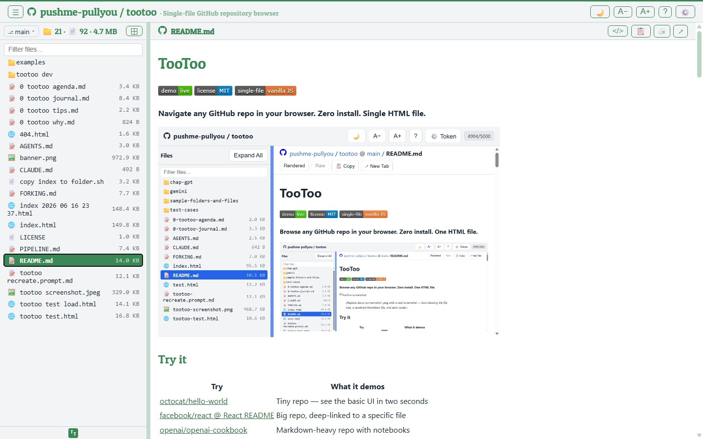

# TooToo

[](https://pushme-pullyou.github.io/tootoo/)
[](LICENSE)
[](index.html)

**Navigate any GitHub repo in your browser. Zero install. Single HTML file.**



## Try it

| Try | What it demos |
| --- | --- |
| [octocat/hello-world](https://pushme-pullyou.github.io/tootoo/?owner=octocat&repo=hello-world) | Tiny repo — see the basic UI in two seconds |
| [facebook/react @ React README](https://pushme-pullyou.github.io/tootoo/?owner=facebook&repo=react#packages/react/README.md) | Big repo, deep-linked to a specific file |
| [openai/openai-cookbook](https://pushme-pullyou.github.io/tootoo/?owner=openai&repo=openai-cookbook) | Markdown-heavy repo with notebooks |
| [torvalds/linux @ master](https://pushme-pullyou.github.io/tootoo/?owner=torvalds&repo=linux&branch=master) | Stress test — token recommended for big trees |

<details>
<summary>More demos</summary>

* <https://pushme-pullyou.github.io/tootoo/?owner=microsoft&repo=vscode>
* <https://pushme-pullyou.github.io/tootoo/?owner=anthropics&repo=claude-code>
* <https://pushme-pullyou.github.io/tootoo/?owner=d3&repo=d3#API.md>
* <https://pushme-pullyou.github.io/tootoo/?owner=xai-org&repo=grok-1>
* <https://pushme-pullyou.github.io/tootoo/?owner=xai-org&repo=grok-prover-v1>
* <https://pushme-pullyou.github.io/tootoo/?owner=openai&repo=whisper>
* <https://pushme-pullyou.github.io/tootoo/?owner=openai&repo=openai-python>
* <https://pushme-pullyou.github.io/tootoo/?owner=pushme-pullyou&repo=pushme-pullyou.github.io>

</details>

## [Examples](examples/)

The [`examples/`](examples/) folder has sample content for every renderer. A few worth a click:

* [`docs/formatting-showcase.md`](examples/docs/formatting-showcase.md) — Markdown headings, lists, code, and links
* [`svg/diagram.svg`](examples/svg/diagram.svg) — inline SVG with a raw-source toggle
* [`images/the-scream.jpg`](examples/images/the-scream.jpg) — image viewer
* [`data/us-county-state-latlon-pop.csv`](examples/data/us-county-state-latlon-pop.csv) — CSV table
* [`pdf/sample.pdf`](examples/pdf/sample.pdf) — PDF viewer
* [`html/sample-page.html`](examples/html/sample-page.html) — sandboxed HTML preview
* [`code/code-sample.js`](examples/code/code-sample.js) — syntax-highlighted code
* [`audio/sample.wav`](examples/audio/sample.wav) — audio player
* [`video/pano.mp4`](examples/video/pano.mp4) — video player

## Why TooToo?

* **Instant cross-tree filter.** Type a few letters, see every matching path. GitHub's web UI only filters the current folder.
* **Sticky sidebar, sticky breadcrumbs.** Scroll a long file without losing context.
* **Built for phones too.** A−/A+ buttons resize everything; the sidebar collapses to a sensible width on narrow screens; dark mode is one tap.
* **Works next to a local checkout.** Drop `index.html` next to a cloned repo and TooToo reads it from disk via `file://` — no API quota burn, no internet required.
* **Drag-and-drop friendly.** One file. Copy it into any repo, push, enable Pages, done.

## Features

* **Single file** — one `index.html` with HTML, CSS, and JS inline
* **Auto-detect** — reads `.git/config`, parses GitHub Pages URLs, or caches to localStorage
* **File tree** — sidebar with collapsible folders, filter input, keyboard navigation
* **Content viewer** — Markdown (rendered via marked), syntax-highlighted code, images, audio, video, PDF, spreadsheets (SheetJS)
* **Dark mode** — toggle with persisted preference
* **Resizable sidebar** — drag to resize, width saved across visits
* **Collapsible sidebar** — toggle with the header button or Ctrl/⌘ B, state persisted
* **Font size controls** — A−/A+ buttons, helpful on phones
* **GitHub token support** — optional PAT for private repos and higher rate limits (5,000/hr vs 60/hr)
* **File text cache** — LRU in-memory + sessionStorage cache to reduce API calls without persisting file contents after the tab session
* **Hash routing** — deep-link to any file or heading via `#path/to/file#anchor`
* **Copy / New Tab / Download** — copy raw text, open viewable files in a new tab, or save non-viewable files (3D, fonts, archives, spreadsheets, binaries) straight to disk
* **Rendered ↔ Raw toggle** — for Markdown, HTML, and SVG files; preference saved per file type
* **Safer HTML previews** — rendered HTML uses a strict iframe sandbox so repository scripts do not run by default
* **Self-test** — render every file off-screen and report which fail to display (About → 🧪 Run self-test)

## Quick Start

**On GitHub Pages** — visit the [live URL](https://pushme-pullyou.github.io/tootoo/) above.

**Drop-in mode** — copy `index.html` into any GitHub repo folder. Open it in a browser. It walks up the directory tree looking for `.git/config` to find the owner and repo.

**Pre-configured** — edit the `CONFIG` object at the top of the script:

```js
const CONFIG = {
  owner: 'pushme-pullyou',
  repo: 'tootoo',
  branch: 'main',
  storagePrefix: 'tootoo',
  appName: 'TooToo',
  sourceRepoUrl: 'https://github.com/pushme-pullyou/tootoo',
};
```

These are the common knobs; `CONFIG` also supports theming and filtering options (`themeColor`, `subtitle`, `hiddenFolders`/`hiddenFiles`, `headingFont`, `maxRepoFiles`) — see [`FORKING.md`](FORKING.md) for the full set. To brand a fork, ship a `favicon.ico` beside `index.html`.

## Fork & Customize

Want your own TooToo pointing at your own repo? It takes about a minute.

1. **Fork** this repository on GitHub (top-right of the repo page).
2. **Edit `CONFIG`** at the top of the `<script>` block in [`index.html`](index.html):

   ```js
   const CONFIG = {
     owner: '',                  // optional: pre-load a specific repo
     repo: '',
     branch: '',                 // empty = use the default branch
     storagePrefix: 'mybrowser', // localStorage namespace
     appName: 'MyBrowser',       // <title> + About heading
     sourceRepoUrl: 'https://github.com/you/your-fork', // file:// fallback for the header
   };
   ```

   On GitHub Pages, the top-header label and link auto-detect from the hostname (`<you>.github.io/<fork>/`), so you don't even need to set `sourceRepoUrl` for the Pages deploy. It's only used as a fallback for `file://` and custom domains.

3. **Customize the favicon** (optional) — drop a `favicon.ico` beside `index.html` in your fork.

4. **Enable Pages**: in your fork's *Settings → Pages*, deploy from the `main` branch root. Your fork goes live at `https://<you>.github.io/<your-fork>/`.

For deeper customization (adding renderers, new buttons, etc.), see [`FORKING.md`](FORKING.md) — covers the architecture, render pipelines, and the gotchas (file://, rate limits, blob lifecycle).

### Browser storage keys

TooToo stores preferences and the GitHub token in the browser's `localStorage`. Recently viewed file contents are cached in `sessionStorage`, so they expire when the tab session ends. Keys are scoped per `location.pathname`, so two TooToo instances on the same origin keep separate state.

| Key | Purpose |
| --- | --- |
| `tootoo:<pathname>:repo` | Detected owner / repo / default branch |
| `tootoo:<pathname>:darkMode` | Dark mode on/off |
| `tootoo:<pathname>:fontSize` | Font size override (px) |
| `tootoo:<pathname>:sidebarWidth` | Last sidebar width (px) |
| `tootoo:<pathname>:sidebarHidden` | Sidebar collapsed on/off (Ctrl/⌘ B) |
| `tootoo:<pathname>:fileTextCache` | Session-only LRU cache of recently viewed file contents |
| `tootoo:<pathname>:viewPref:<ext>` | Rendered / Raw toggle per file extension |
| `tootoo:<pathname>:currentFile:<owner>/<repo>/<branch>` | Last-opened file in that repo (sessionStorage — clears with the tab) |
| `tootoo:<pathname>:githubToken` | GitHub Personal Access Token for this TooToo instance |

To wipe state, click ⚙️ Token → **Reset all TooToo data**, or clear both `localStorage` and `sessionStorage` in DevTools.

## Constraints

* Vanilla JavaScript — no frameworks, no build tools, no Node.js
* ES2020+ — `const`/`let`, arrow functions, template literals, async/await
* Static hosting only — GitHub Pages or open from `file://`
* External CDN deps: marked, highlight.js, DOMPurify, SheetJS

## Roadmap

TooToo stays intentionally small: single-file, vanilla JavaScript, static hosting, and `file://` friendly. These ideas are candidates, not promises.

### Next

* Add better text search: search within the current file first, then loaded/cached text files, with optional rate-limit-aware search across small repo text files.
* Add richer previews for common data files, starting with friendlier `.csv` and `.json` views.
* Add visible local-mode/rate-limit status so users know whether TooToo is reading local files, raw GitHub files, or the GitHub API.
* Add an in-app keyboard-shortcut help overlay (the About page already lists `/`, `\`, arrows, Ctrl/⌘ B, and Esc).

### Later

* Improve Markdown navigation: README anchors, relative links with query/hash, and GitHub folder links.
* Add search results with matching file paths, line snippets, next/previous navigation, and clear filename-vs-content search modes.
* Add share/copy actions for deep links, raw URLs, and GitHub URLs.
* Polish mobile behavior with an easier sidebar toggle and simpler header layout.
* Expand `examples/` for CSV, extensionless files, Markdown links, text search, and New Tab routing.

### Maybe

* Lightweight image/file metadata panels.
* Optional JSON tree viewer.
* More fork-customization helpers for app name, favicon, storage prefix, and source repo URL.

## Project Structure

```text
index.html                    ← canonical production app (GENERATED — do not hand-edit)
README.md                     ← user-facing docs (this file)
FORKING.md                    ← architecture + recipes for forkers
AGENTS.md                     ← AI agent guidance
CLAUDE.md                     ← Claude pointer file
PIPELINE.md                   ← dev → promote → sync → publish release flow
tootoo.config.js              ← this repo's own per-fork config
tootoo-dev/                   ← SOURCE: everything index.html is built from
  src/                        ← js/ · styles.css · components/ · config.js
  assemble.ps1                ← builds index.html from src/
  0-tootoo-agenda.md          ← priorities and ideas
  0-tootoo-journal.md         ← development notes
tootoo-test.html              ← standalone test harness for pure helpers
tootoo-test-load.html         ← manual GitHub raw-file load tester for this repo
examples/                     ← sample content + render fixtures, organized by file type (with index README)
.archive/                     ← older snapshots
.github/prompts/              ← generation/merge/rebuild prompts
.gemini/                      ← alternate-model experiments
```

## License

MIT — Copyright pushme-pullyou. See [`LICENSE`](LICENSE).

## Change Log

* 2026-07-06 — Second cleanup pass from a code review: folder tooltips compute their file/size stats in a single pass (snappier on large trees); `mailto:`/`tel:` and other scheme links in Markdown open externally instead of erroring; deep links into image-heavy files re-scroll to the anchor once images finish loading; the Copy button confirms even on an empty file; switching branches now clears an active filter; and an explicit `?branch=` wins over the cached branch. Accessibility: a visible keyboard focus ring on every control, `aria-pressed` on the dark-mode toggle, `aria-controls` on the sidebar toggle, and the selected-file row now meets WCAG AA contrast in dark mode
* 2026-07-06 — Opening TooToo fresh — or reopening it after the browser restored the tab — now lands on the home page instead of the file you last had open; a normal reload still keeps your place, and a directly opened `#permalink` still jumps straight to its file
* 2026-07-06 — Robustness pass from a code review: the app now boots (with default appearance) when the browser blocks localStorage; a rate-limit/not-found explanation is no longer clobbered when the URL carries a `#permalink`; expanding a folder with the keyboard auto-opens its README / latest post just like a click; the About panel renders instantly and fills the rate-limit line in when it arrives; Enter submits the repo form from either field; file extensions are read from the file name only (a dotted folder name no longer confuses the viewer); navigating away now also cancels in-flight markdown image fetches
* 2026-07-05 — Permalinks now keep clean slashes in the address bar and support in-file anchors: deep links use `#path/to/file#anchor`, markdown heading links scroll correctly, and browser back/forward preserves file history without misreading anchors as file paths
* 2026-07-05 — TooToo now assumes a real `favicon.ico` beside `index.html`; the tab icon and the header/footer/sidebar brand marks all use that file directly, and the dev build auto-generates a TT placeholder icon when the sandbox folder lacks one
* 2026-06-26 — Narrow screens now keep the `owner / repo` title beside the logo (the title shrinks and breaks only at the slash if it must) and hide the subtitle, instead of dropping the title to its own line and wasting vertical space
* 2026-06-26 — Footer copyright's rights line is now configurable and owner-scoped: new `rightsText` / `rightsOwners` config knobs — the phrase (e.g. "No rights reserved") shows only for owners you list (your own repos) and stays blank on everyone else's
* 2026-06-26 — Links in rendered files are underlined with a clearer hover (brighter color + tinted background pill); the header logo and title gained a matching hover effect
* 2026-06-24 — Browser storage keys dropped the internal `-dev:` segment (now `<storagePrefix>:<pathname>:…`, matching the documented keys); existing saved preferences and the GitHub token reset once as a result
* 2026-06-24 — HTML preview note now points to the `</>` Show raw source button and describes New Tab accurately (it opens the file directly; GitHub's raw host shows source, not a rendered page)
* 2026-06-24 — Expanding a folder now opens that folder's own README the first time, mirroring the blog's auto-open of its latest post; toggle with `autoOpenFolderReadme`
* 2026-06-24 — Footer license link and the About panel no longer assert MIT specifically — the footer link now reads "License" and points at the repo's own LICENSE file when present
* 2026-06-24 — New `faviconFile` config knob: a fork that ships a real `favicon.ico` can declare it to skip the existence probe and the generated letter-mark
* 2026-06-24 — `hiddenFiles` entries may start with `/` to anchor to the repo root (e.g. `/index.html` hides only the root file, not nested ones)
* 2026-06-23 — Rebuilt from standalone, separately-runnable components (header, sidebar, content, footer + shared CSS and core/main JS) that assemble into this single `index.html`; feature-complete against the previous build, with the per-fork `tootoo.config.js` model unchanged. Source + assembler now live in `tootoo-dev/`
* 2026-06-23 — Footer now flows at the end of the content instead of staying pinned to the viewport
* 2026-06-23 — Favicon, the footer/sidebar brand marks, and the optional heading font are all driven by `tootoo.config.js` (`faviconLetters`, `faviconColor`, `headingFont`, `headingFontUrl`)
* 2026-06-23 — Header "Last updated" tooltip now reflects the browsed repo's latest push date rather than the build date
* 2026-06-23 — On `file://` when the browser blocks local-file reads, TooToo explains how to enable access instead of silently loading the default repo
* 2026-06-21 — Hovering the header title now shows the last-updated date as a tooltip even when no subtitle is configured (previously the "Last updated" tooltip only existed on the optional subtitle text)
* 2026-06-08 — About and Token header buttons now toggle: clicking again closes the panel and returns to the file you were viewing, with the active button shown pressed
* 2026-06-08 — New Tab is now an honest action — viewable files (HTML, PDF, images, media, text/source) open in a tab, while non-viewable files (3D models, fonts, archives, spreadsheets, binaries, extensionless) get a **Download** button that saves directly; local downloads no longer flash a throwaway tab
* 2026-06-08 — Viewable vs downloadable is now decided by an allowlist of browser-renderable types instead of a blocklist, so new binary formats (e.g. `.stl`) are handled correctly without chasing the list
* 2026-06-08 — About page now shows the current branch with links to its tree and the repo's full branch list; the keyboard-shortcut list adds Ctrl/⌘ B and Esc
* 2026-06-08 — Broken in-repo links now show a plain "file not found" message instead of misfiring the private-repo token panel
* 2026-06-08 — Rate-limit handling now distinguishes a real quota 403/429 (token panel) from other 403s (reported plainly)
* 2026-06-08 — Sidebar file rows expose `role="button"` so screen readers announce them as actionable
* 2026-05-18 — Restored repo-local agent guidance as `AGENTS.md` with `CLAUDE.md` as a small pointer file, so TooToo-specific workflow rules are active again
* 2026-05-18 — File-content cache now uses sessionStorage instead of localStorage; legacy persistent file-cache entries are cleared on restore/reset
* 2026-05-18 — Markdown link rewriting now keeps custom schemes intact, avoids treating query strings/fragments as filenames, and handles GitHub blob links on branches containing `/`
* 2026-05-18 — New Tab now opens data/media files such as `.csv` and extensionless files through raw URLs instead of GitHub Pages, and opens the tab synchronously to avoid popup blockers
* 2026-04-25 — Top-header label and GitHub icon now derive from `APP_ORIGIN` (where this app instance is hosted), independent of the currently browsed repo; on `file://` it reads the surrounding `.git/config`
* 2026-04-25 — Token panel auto-opens on rate-limit (403) with explanation of why a token is needed and where to get one
* 2026-04-25 — Pinned CDN versions (marked@12.0.2, dompurify@3.4.1, xlsx@0.20.3) to insulate against upstream breakage
* 2026-04-25 — README auto-select now matches more variants (`README`, `README.markdown`, `README.mkd`, `README.mdown`, `README.txt`); falls back to the About page if no root README exists
* 2026-04-25 — `probeLocalMode` now respects the abort signal so probes stop when the user navigates away mid-load
* 2026-04-25 — Filter and visible-tree-item logic now use an `.is-hidden` class instead of inline-style sniffing
* 2026-04-25 — View-toggle buttons (Rendered/Raw) drive their styling from `aria-pressed` instead of inline `style="opacity:..."`
* 2026-04-25 — Removed duplicate `/` keyboard handler; merged the two `beforeunload` listeners
* 2026-04-25 — Active tree-item scroll uses `behavior: 'auto'` so rapid keyboard navigation no longer fights smooth-scroll
* 2026-04-25 — `renderCode` now always builds via `textContent`, skipping the escape pass for very large files
* 2026-04-25 — Configured defaults now act as a fallback after repo auto-detection instead of short-circuiting URL, cache, Pages, and .git/config detection
* 2026-04-25 — 403 responses in repo-info and authenticated file fetches now surface the same rate-limit warning used by tree loading
* 2026-04-25 — Repo breadcrumb now resets to a true home state instead of leaving the previously opened file view onscreen
* 2026-04-25 — Last-opened file persistence is now scoped per owner/repo/branch and ignores stale paths not present in the current tree
* 2026-04-25 — Markdown now resolves relative image paths against the current file location in the repository browser
* 2026-04-25 — Renamed: the app is now simply "TooToo" (the previous "LT" suffix is dropped); older/full TooToo files moved to their own repository
* 2026-04-25 — HTML rendered previews now use a strict sandbox so repository scripts do not run by default
* 2026-04-09 — Help button with live rate limit, tips section
* 2026-04-09 — GitHub Pages URL auto-detection, file:// XHR detection
* 2026-04-07 — Style adjustments, About button
* 2026-04-06 — New tab: use raw URL when not on Pages
